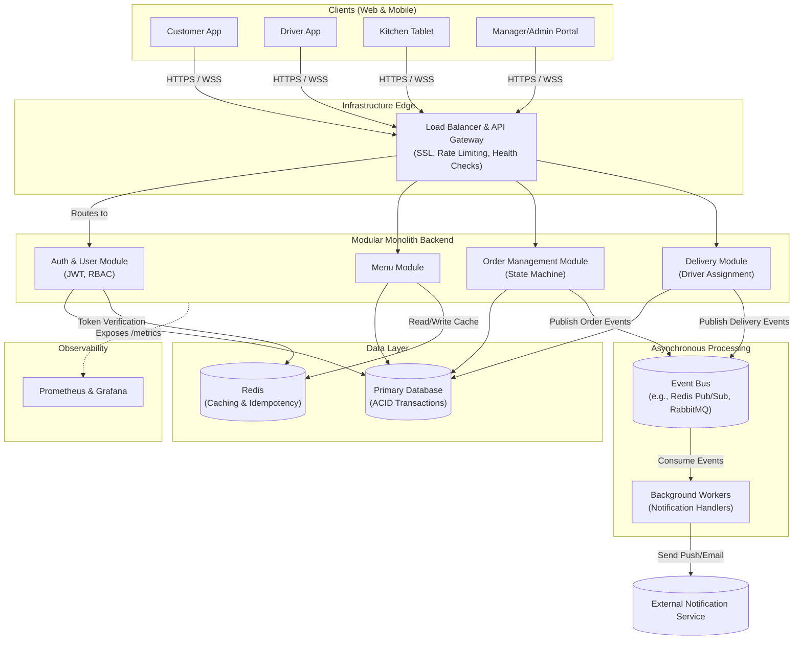
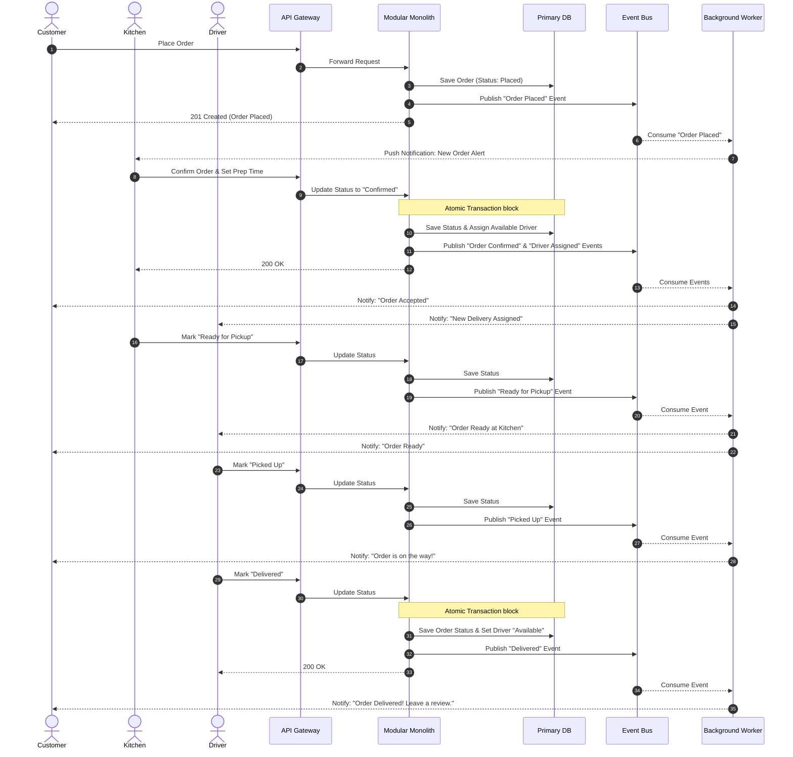

# Architecture Diagrams

Here are the visual diagrams for your system. (These should render as actual drawings here in the artifact viewer).

## 1. High-Level Architecture

---

## 2. End-to-End Order Flow

