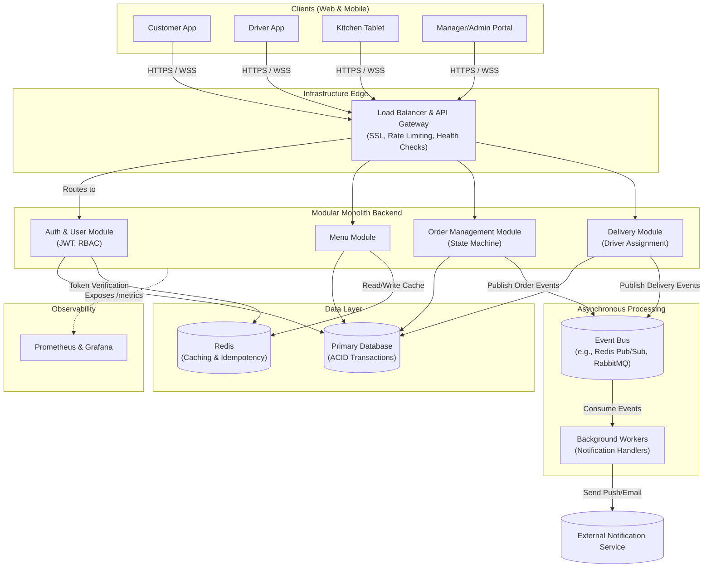
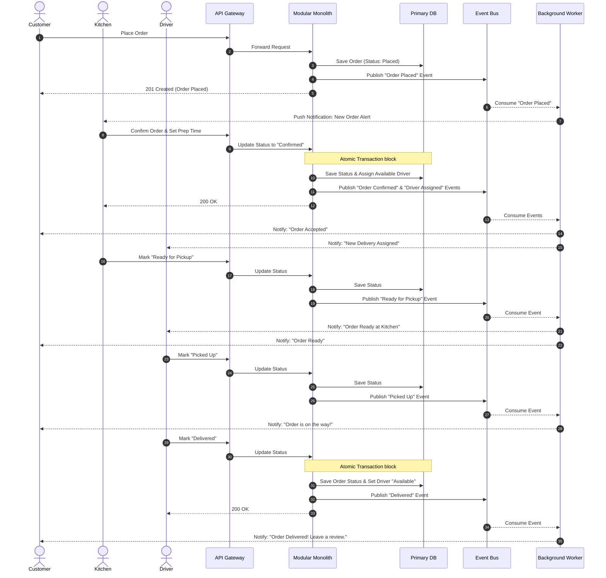

# High Level Design (HLD)

This document outlines the high-level architecture of the Restaurant Delivery System based on the established requirements.

## System Architecture Diagram

The system follows a Modular Monolith architecture pattern, utilizing an API Gateway at the edge, a primary relational database, Redis for caching, and an asynchronous event-driven subsystem for notifications and background tasks.

## Component Details

### 1. Clients
*   **Customer App:** Consumer-facing interface for browsing menus, placing orders, and tracking status (using **Leaflet** for real-time map rendering).
*   **Driver App:** Interface for delivery personnel to receive assignments, update delivery stages, and broadcast location.
*   **Kitchen Tablet:** Interface for kitchen staff to manage order preparation states.
*   **Manager/Admin Portal:** Web application for menu, user, and restaurant management.

### 2. Infrastructure Edge
*   **Load Balancer / API Gateway:** The single entry point into the backend. It terminates SSL/TLS connections, handles cross-cutting concerns like rate limiting (Security 2.4), and routes traffic to healthy backend instances to ensure high availability (2.5).

### 3. Modular Monolith Backend
The core application containing all business logic, segmented into strict modules:
*   **Auth Module:** Handles user registration, login, and issues/verifies JWTs.
*   **Menu Module:** Manages items, categories, and availability. Optimized for high read volume.
*   **Order Module:** Enforces the order state machine and handles concurrent operations (e.g., preventing dual cancellation/confirmation).
*   **Delivery Module:** Handles driver states, reassignments, and delivery lifecycle.

### 4. Asynchronous Processing
*   **Event Bus:** Decouples core systems from secondary processes. When an order changes state, an event is published here.
*   **Background Workers:** Listen for events on the bus. Primarily responsible for sending notifications without blocking the HTTP request thread, fulfilling requirement 1.6.

### 5. Data Layer
*   **Primary Database:** A relational database (e.g., PostgreSQL or MySQL) ensuring strict transactional consistency (ACID) for order processing and driver assignments.
*   **Redis Cache:** Used for extremely fast retrieval of menu data (under 50ms per req 2.1) and storing idempotency keys to prevent duplicate requests.

### 6. Observability
*   The backend exposes a `/metrics` endpoint. **Prometheus** scrapes these metrics, and **Grafana** visualizes them for system health monitoring (2.6).

---

## End-to-End Order Lifecycle Flow

This sequence diagram illustrates the step-by-step flow of data and events across the system's architecture, from the moment a customer places an order to when it is delivered.

