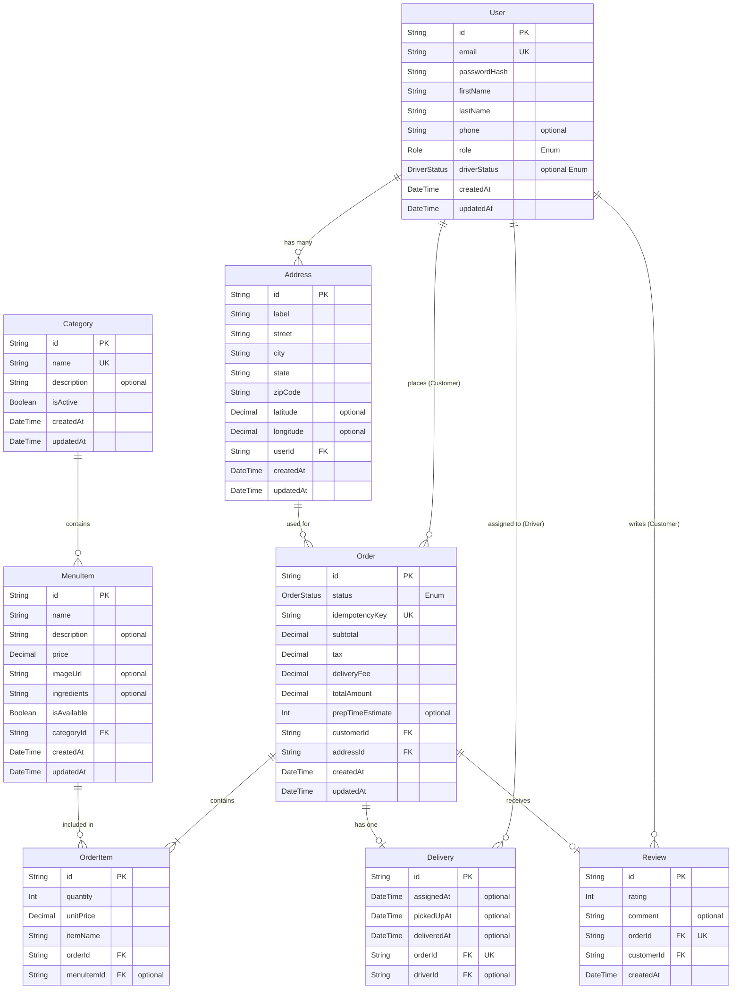

# Database Design

This document outlines the database architecture for the Restaurant Delivery System, designed using an entity-relationship approach and optimized for implementation with Prisma ORM.

## 1. Entity-Relationship Diagram (ERD)

The following diagram visualizes the tables, their attributes, and the relationships between them.



## 2. Complete Prisma Schema

Here is the final, unified `schema.prisma` file that represents this design.

```prisma
datasource db {
  provider = "postgresql"
  url      = env("DATABASE_URL")
}

generator client {
  provider = "prisma-client-js"
}

// --- ENUMS ---
enum Role {
  CUSTOMER
  STAFF
  KITCHEN
  DRIVER
  ADMIN
}

enum DriverStatus {
  OFFLINE
  AVAILABLE
  BUSY
}

enum OrderStatus {
  PLACED
  CONFIRMED
  PREPARING
  READY_FOR_PICKUP
  PICKED_UP
  DELIVERED
  CANCELLED
  DELIVERY_FAILED
}

// --- MODELS ---

model User {
  id           String        @id @default(uuid())
  email        String        @unique
  passwordHash String
  firstName    String
  lastName     String
  phone        String?
  
  role         Role          @default(CUSTOMER)
  driverStatus DriverStatus? 
  
  // Relations
  addresses    Address[]
  orders       Order[]       // Orders placed if Customer
  deliveries   Delivery[]    // Deliveries assigned if Driver
  reviews      Review[]      // Reviews written if Customer

  createdAt    DateTime      @default(now())
  updatedAt    DateTime      @updatedAt
}

model Address {
  id        String   @id @default(uuid())
  label     String   
  street    String
  city      String
  state     String
  zipCode   String
  latitude  Decimal? @db.Decimal(10, 8)
  longitude Decimal? @db.Decimal(11, 8)

  // Relations
  user      User     @relation(fields: [userId], references: [id], onDelete: Cascade)
  userId    String
  orders    Order[]

  createdAt DateTime @default(now())
  updatedAt DateTime @updatedAt
}

model Category {
  id          String     @id @default(uuid())
  name        String     @unique
  description String?
  isActive    Boolean    @default(true)
  
  items       MenuItem[] 

  createdAt   DateTime   @default(now())
  updatedAt   DateTime   @updatedAt
}

model MenuItem {
  id          String      @id @default(uuid())
  name        String
  description String?
  price       Decimal     @db.Decimal(10, 2)
  imageUrl    String?
  ingredients String?
  isAvailable Boolean     @default(true)

  // Relations
  category    Category    @relation(fields: [categoryId], references: [id])
  categoryId  String
  orderItems  OrderItem[]

  createdAt   DateTime    @default(now())
  updatedAt   DateTime    @updatedAt
}

model Order {
  id               String      @id @default(uuid())
  status           OrderStatus @default(PLACED)
  idempotencyKey   String      @unique
  
  // Financial Breakdowns
  subtotal         Decimal     @db.Decimal(10, 2)
  tax              Decimal     @db.Decimal(10, 2)
  deliveryFee      Decimal     @db.Decimal(10, 2)
  totalAmount      Decimal     @db.Decimal(10, 2)
  
  prepTimeEstimate Int?        

  // Relations
  customer         User        @relation(fields: [customerId], references: [id])
  customerId       String
  
  address          Address     @relation(fields: [addressId], references: [id])
  addressId        String
  
  items            OrderItem[]
  
  delivery         Delivery?   
  review           Review?     

  createdAt        DateTime    @default(now())
  updatedAt        DateTime    @updatedAt
}

model OrderItem {
  id         String   @id @default(uuid())
  quantity   Int
  unitPrice  Decimal  @db.Decimal(10, 2)
  itemName   String   

  // Relations
  order      Order    @relation(fields: [orderId], references: [id], onDelete: Cascade)
  orderId    String
  menuItem   MenuItem? @relation(fields: [menuItemId], references: [id], onDelete: SetNull)
  menuItemId String?
}

model Delivery {
  id          String    @id @default(uuid())
  assignedAt  DateTime?
  pickedUpAt  DateTime?
  deliveredAt DateTime?

  // Relations
  order       Order     @relation(fields: [orderId], references: [id], onDelete: Cascade)
  orderId     String    @unique 
  
  driver      User?     @relation(fields: [driverId], references: [id])
  driverId    String?
}

model Review {
  id         String   @id @default(uuid())
  rating     Int      
  comment    String?

  // Relations
  order      Order    @relation(fields: [orderId], references: [id])
  orderId    String   @unique
  customer   User     @relation(fields: [customerId], references: [id])
  customerId String

  createdAt  DateTime @default(now())
}
```
